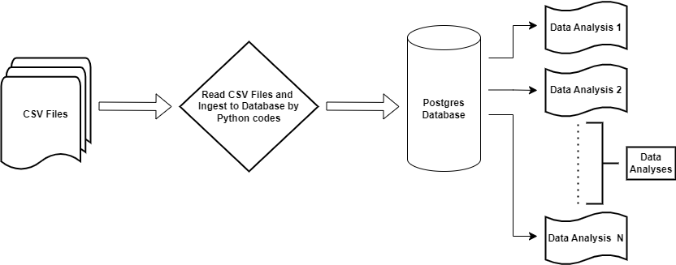

## How to approach the task:

1. Firstly, I created a database and named it "Postgres" and set the host as localhost. Moreover, I put the database configurations in the txt file and named it "dbConfigs.txt".
Secondly, I read the CSV files by pandas read_csv function and put them in corresponding DataFrames, then connected to the Postgres database with dbConfigs information. Subsequently, if the tables did not exist in the database, I ingested the Dataframes to the corresponding tables in the database.
In addition, I wrote some data cleaning and analysis queries by Python codes to show that I transformed data in both Python and SQL.

2. There was a data analysis challenge when I wanted to join the datasets together because the result table became too big and it needs some more solutions one solution would be using the Databricks platform and using pyspark.sql.

3. The data pipeline UML diagram is presented as follows: 

4. In the analyses, I mostly grouped each category because there are some informative categorical and numerical columns and found the sum or count of the categories in the table. Moreover, I did a bit of cleaning (checked duplicates of rows) and data conversion (converted text data to date). Consequently, I inserted a few analyses into the new tables.

5. Finally, we could apply a few non-cluster indexes on some of the most frequent columns to increase the speed of the outputs. I analyzed the tables wrote some important analyses by SQL codes, and put them in "Solutions_SQL Scripts.sql" file.

